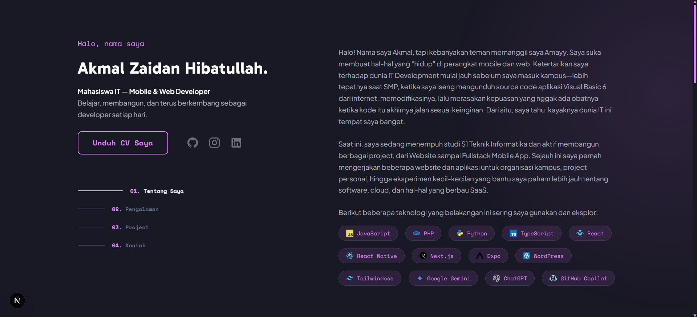

# Portfolio - Akmal Zaidan Hibatullah

Personal portfolio website yang menampilkan informasi tentang diri saya, keterampilan, pengalaman, dan proyek yang telah saya kerjakan.

🔗 **Live Demo**: [akmalzaidan.dev](https://akmalzaidan.dev)



## Tech Stack

| Category | Technologies |
|----------|-------------|
| **Framework** | Next.js 16, React 19 |
| **Language** | TypeScript |
| **Styling** | Tailwind CSS v4 |
| **Fonts** | Gabarito, Plus Jakarta Sans, Space Mono |
| **Icons** | Iconify |
| **PDF** | @react-pdf/renderer |
| **Analytics** | Vercel Analytics |
| **Scroll** | Lenis |

## Struktur Proyek

```
src/
├── app/                    # Next.js App Router
│   ├── page.tsx            # Homepage
│   ├── layout.tsx          # Root layout
│   ├── loading.tsx         # Loading skeleton
│   └── resume/             # CV preview page
│
├── components/
│   ├── layout/             # Layout components
│   ├── sections/           # Section components (about, experience, project)
│   ├── cards/              # Card components
│   ├── cv/                 # CV document & download
│   └── ui/                 # UI primitives
│
├── data/                   # JSON data files
│   ├── personal.json       # Personal info & skills
│   ├── experience.json     # Work experience
│   └── project.json        # Projects data
│
└── lib/                    # Utilities
```

## Getting Started

### Prerequisites

- Node.js 18+
- npm / yarn / pnpm

### Installation

```bash
# Clone repository
git clone https://github.com/m4mayz/portofolio.git
cd portofolio

# Install dependencies
npm install

# Run development server
npm run dev
```

Buka [http://localhost:3000](http://localhost:3000) di browser.

### Build

```bash
# Production build
npm run build

# Start production server
npm run start
```

## Customization

### Personal Data
Edit file di folder `src/data/`:
- `personal.json` - Informasi personal, skills, pendidikan
- `experience.json` - Pengalaman kerja/organisasi
- `project.json` - Daftar proyek

### Styling
- `src/app/globals.css` - CSS variables dan global styles
- Warna tema: `--green: #e384ff` (bisa diubah)

## License

MIT License - silakan gunakan untuk portfolio pribadi Anda!

## Author

**Akmal Zaidan Hibatullah**
- GitHub: [@m4mayz](https://github.com/m4mayz)
- LinkedIn: [m4mayz](https://linkedin.com/in/m4mayz)
- Instagram: [@m4mayz](https://instagram.com/m4mayz)
